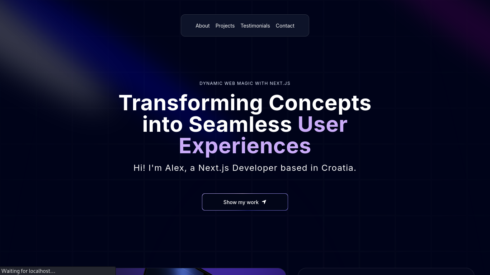

<h1>
  
  Alex — Developer Portfolio
</h1>


[](https://grep-many.github.io/alex-portfolio/)


[](./LICENSE)

> A modern **3D developer portfolio** built with **Next.js 16**, **React 19**, **TailwindCSS 4**, and **Three.js**.

---

## ✨ Overview

**Alex Portfolio** is a high-performance, visually rich personal portfolio website built to showcase projects, experience, and skills using immersive visuals and smooth animations.

---

## 🖥️ Desktop Preview



---

## 📦 Tech Stack

### Frontend
- Next.js 16 (App Router)
- React 19
- TailwindCSS 4
- Three.js
- @react-three/fiber
- @react-three/drei

### Developer Tools
- TypeScript 5
- ESLint 9
- Prettier

---

## 📁 Folder Structure

```bash
.
├── app
│   ├── layout.tsx
│   ├── page.tsx
│   ├── globals.css
│   └── icons & metadata
├── components
│   ├── Hero, Projects, Experience, Clients
│   ├── Approach, Grid, Footer
│   └── ui
│       ├── Globe, BentoGrid, FloatingNavbar
│       ├── CanvasRevealEffect, Spotlight
│       └── Reusable animated UI components
├── data
│   ├── projects.ts
│   ├── navItems.ts
│   ├── workExperience.ts
│   ├── testimonials.ts
│   └── socialMedia.ts
├── public
│   ├── images, svg, icons
│   ├── manifest.webmanifest
│   └── static assets
├── lib
│   └── utils.ts
├── constants.ts
├── screenshots
│   └── preview.png
├── next.config.ts
├── tsconfig.json
├── package.json
└── README.md
```

---

## 🔧 Customization

Edit `constants.ts`:

```ts
export const name = "Alex";
export const github = "alex-custom";
export const email = "alex@custom.com";
export const basePath = "/alex-portfolio";
```

---

## 🛠️ Getting Started

```bash
git clone https://github.com/grep-many/alex-portfolio.git
cd alex-portfolio
npm install
npm run dev
```

---
## 🚀 Features

- WebGL-powered 3D globe & canvas animations
- Smooth motion effects and transitions
- Modular UI component system
- SEO-friendly Next.js App Router
- GitHub Pages compatible (basePath support)
- Fully responsive layout

---

## 🪪 License
This project is open-source under the [**MIT License**](./LICENSE).
